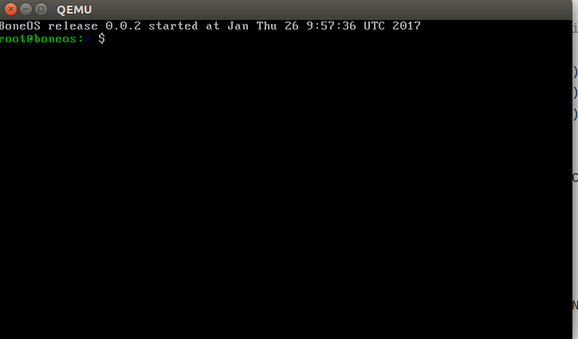

###Using the Shell

When one boots BoneOS, they get a shell:

This shell is the main way of performing different tasks using BoneOS. 

In this page, I am going to cover few important things while using the terminal. One may also want to see:

 - The docs for the commands in BoneOS
 - The shortcut keys in the terminal
 
**Left and Right Arrow keys**

The shell provides support of the left and right arrow keys. This means if you make a mistake while typing a command, you can easily edit the command using the left and right arrow keys.

**The TAB key**

The TAB key offers the auto-complete option so that you don't have to type long commands everytime. 

**Time and Date**

One can check the current UTC time by using the `date` command.

**Using multiple shell instances**

One can open many shell instances using the `boneshell` command, and exit them using the `exit` command.

**Poweroff and Reboot**

One can shutdown BoneOS by using the `poweroff` command, and reboot the system using the `reboot` command.
